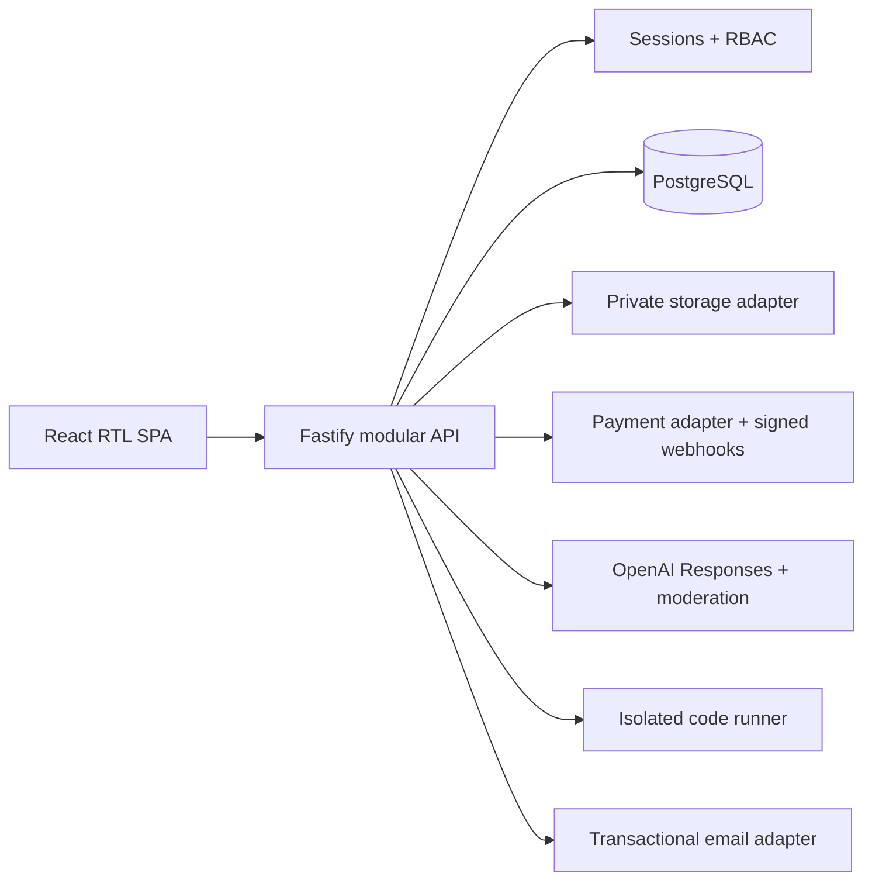

# Architecture

The repository is a modular monolith: routes are grouped by domain and share centralized configuration, authentication, storage, audit, and provider services. Development can run with an explicit in-memory store and local adapters. Production configuration rejects memory storage, sandbox payment, development email/storage, and local code execution.

PostgreSQL migrations are ordered, transactionally applied, checksum-protected, and serialized with an advisory lock. Financial webhook handling, enrollment, and refund bookkeeping use database transactions and idempotency keys.

The browser always calls the API with an HttpOnly session cookie. Learning progress, grading, orders, uploads, sessions, privacy export/deletion, portals, and notifications are server-backed; local storage is used only for a non-authoritative visual progress fallback and theme-like presentation state.

External adapters are intentionally narrow HTTP contracts so credentials and provider-specific behavior stay outside business rules. Their request timeouts and response schemas are tested, but live credentials and target-environment drills remain deployment gates.
